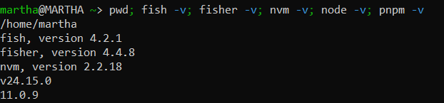
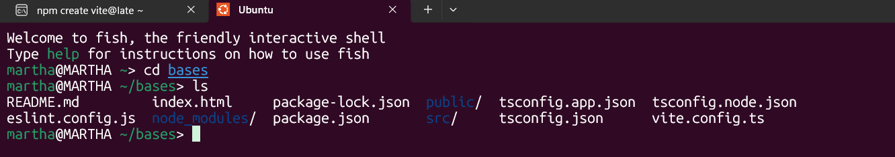
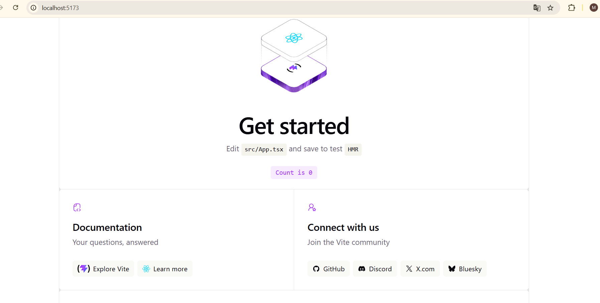

# Práctica de React - Programación Web II

**Estudiante:** Martha Gonzales Chumacero  

---

# Configuración del Entorno de Desarrollo

Para esta práctica se configuró un entorno de desarrollo moderno utilizando las siguientes herramientas:

1. **WSL (Ubuntu)** → Entorno Linux dentro de Windows.
2. **Fish Shell & Fisher** → Terminal optimizada para desarrollo.
3. **Node.js & npm** → Entorno de ejecución para JavaScript.
4. **Vite** → Herramienta rápida para crear proyectos React.
5. **React + TypeScript** → Framework frontend utilizado en la práctica.
6. **VS Code** → Editor de código utilizado para el proyecto.

---

# Verificación del Entorno

Se verificó correctamente la instalación de las herramientas necesarias mediante comandos en terminal.

## Captura de Verificación



```bash
pwd
fish -v
fisher -v
nvm -v
node -v
pnpm -v
```

---

# Instalación de WSL 2

Se instaló Ubuntu mediante WSL para trabajar en un entorno Linux dentro de Windows.

```bash
wsl --install

wsl --update

wsl --list --verbose

wsl --set-version Ubuntu 2

wsl --set-default-version 2
```

---

# Instalación de Fish Shell

Fish Shell fue utilizado para mejorar la experiencia en terminal.

```bash
sudo apt update

sudo apt install fish

fish
```

---

# Instalación de Fisher

Fisher fue instalado como administrador de paquetes para Fish Shell.

```bash
curl -sL https://git.io/fisher | source && fisher install jorgebucaran/fisher
```

---

# Instalación de Node.js y npm

Se instalaron y actualizó Node.js a la versión más reciente utilizando nvm para trabajar con proyectos React modernos.

```bash
nvm install latest

nvm use latest
```

Verificación:

```bash
node -v

npm -v
```

---

# Creación del Proyecto React con Vite y TypeScript

Se creó un proyecto React utilizando Vite y TypeScript.

```bash
npm create vite@latest
```

Opciones seleccionadas:

```text
Project name:
bases

Select a framework:
React

Select a variant:
TypeScript + React Compiler
```

## Captura de Creación del Proyecto



---

# Instalación de Dependencias

Luego de crear el proyecto se instalaron las dependencias necesarias.

```bash
cd bases

npm install
```

---

# Ejecución del Proyecto

Para iniciar el servidor de desarrollo se ejecutó:

```bash
npm run dev
```

El proyecto quedó disponible en:

```text
http://localhost:5173
```

---

# Captura del Proyecto React

Se ejecutó correctamente el proyecto React utilizando Vite en Ubuntu WSL desde Visual Studio Code.



---

# Estructura Generada del Proyecto

El proyecto React generado automáticamente contiene la siguiente estructura:

```text
bases/
│
├── node_modules/
├── public/
├── src/
├── package.json
├── vite.config.ts
├── tsconfig.json
└── README.md
```

---

# Herramientas Utilizadas

- Ubuntu WSL2
- Fish Shell
- Fisher
- Node.js
- npm
- React
- TypeScript
- Vite
- Visual Studio Code
- GitHub

---

# Resultado Final

Se logró configurar correctamente un entorno de desarrollo moderno utilizando Ubuntu WSL, Fish Shell y React con Vite, permitiendo ejecutar aplicaciones React localmente desde Visual Studio Code.